# ⭐ Protótipo STELLAR para Avaliação - Selo de Inovação SBC 2025

## ℹ️ Descrição

Este repositório contém o protótipo funcional do projeto **STELLAR**, submetido ao Concurso do Selo de Inovação SBC - 2025.

STELLAR (Structured, Trustworthy, and Explainable LLM-Led Architecture for Reliable Customer Support) é uma arquitetura modular inovadora, baseada em Grafo Acíclico Direcionado (DAG) e Large Language Models (LLMs), para a construção de sistemas de suporte ao cliente (Customer Support - CS) inteligentes, confiáveis e explicáveis. O objetivo é orquestrar LLMs de forma controlada, garantindo previsibilidade, rastreabilidade e segurança nas interações automatizadas.

Este protótipo demonstra a implementação da arquitetura e seus módulos principais, utilizando dados publicamente disponíveis da Bradesco Seguros como estudo de caso.

## 🏗️ Arquitetura e Módulos: Visão Geral

A arquitetura STELLAR é organizada como um Grafo Acíclico Direcionado (DAG) composto por módulos especializados, projetados para garantir um fluxo de interação controlado e confiável. As figuras a seguir ilustram a estrutura geral e o papel de cada componente principal.

**Estrutura Geral (DAG):**

<p align="center">
  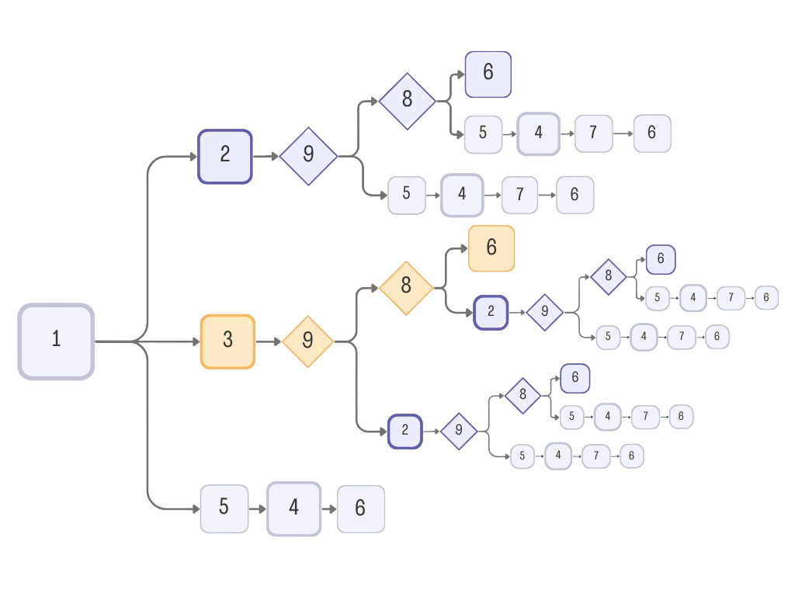
</p>
(Figura 1: Visão completa da arquitetura STELLAR em DAG, mostrando todos os módulos e as possíveis transições entre eles, que resultam nos 11 fluxos de trabalho predefinidos.)

**Fluxos Principais e Pontos de Decisão:**

<p align="center">
  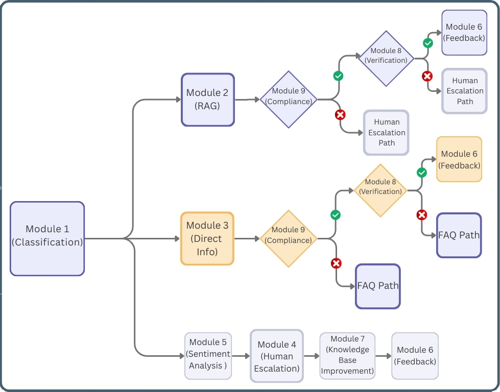
</p>
(Figura 2: Ilustração simplificada destacando os três caminhos iniciais principais (acionados pelo Módulo 1: Roteamento) e o papel dos Módulos 8 (Verificação com Usuário) e 9 (Verificação de Conformidade) como pontos chave de decisão e divergência de fluxo.)

---

**Componentes Modulares:**

A seguir, uma breve descrição da função de cada módulo, acompanhada de seu diagrama representativo:

### Módulo 1: Classificador de Intenção

<p align="center">
  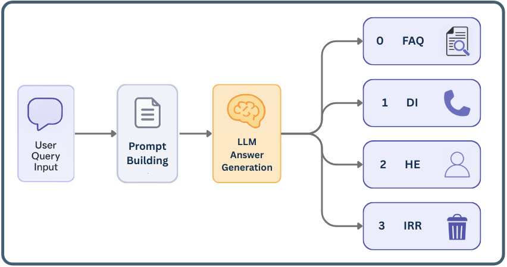
</p>
(Analisa a consulta inicial do usuário e a direciona para o caminho de resolução mais adequado (FAQ, Informação Direta, Atendente Humano ou Irrelevante)

### Módulo 2: Recuperação de FAQ (RAG)

<p align="center">
  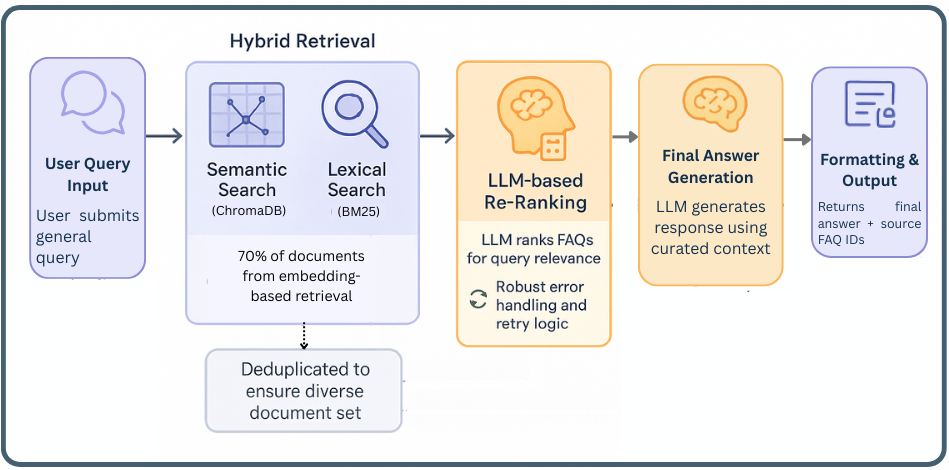
</p>
(Responde a perguntas gerais utilizando Retrieval-Augmented Generation (RAG) híbrido sobre a base de conhecimento de FAQs)

### Módulo 3: Recuperador de Informações Diretas

<p align="center">
  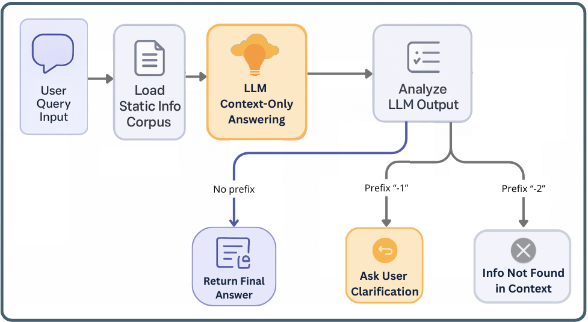
</p>
(Extrai informações factuais e específicas (ex: contatos, detalhes de planos) diretamente de um corpus de informação pré-definido via *in-context learning*)

### Módulo 4: Gerenciador de Contexto para Agente Humano

<p align="center">
  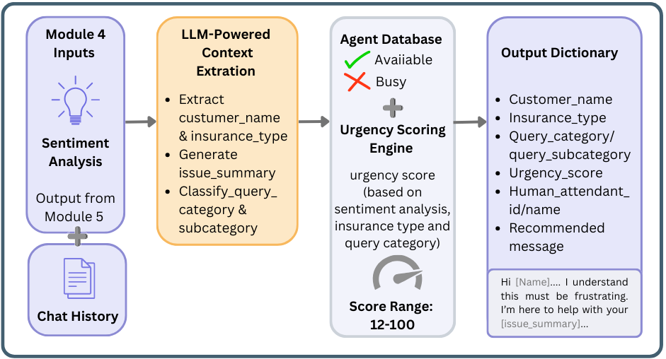
</p>
(Prepara o contexto da interação, calcula um score de urgência e gerencia o encaminhamento ou fila de espera para um agente humano)

### Módulo 5: Análise de Sentimento

<p align="center">
  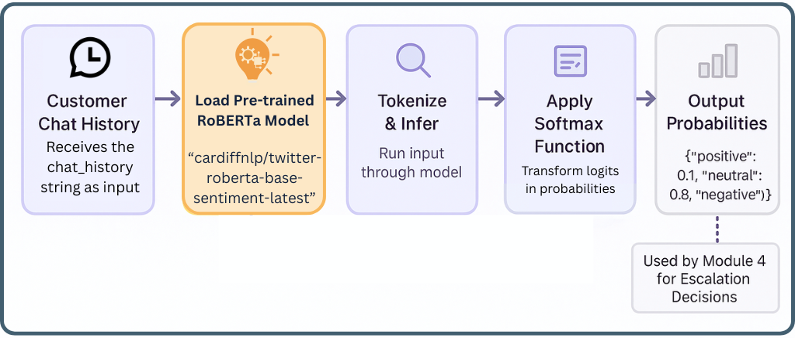
</p>
(Avalia o tom emocional expresso pelo usuário durante a interação, fornecendo um input para a avaliação de urgência.)

### Módulo 6: Coletor de Feedback

<p align="center">
  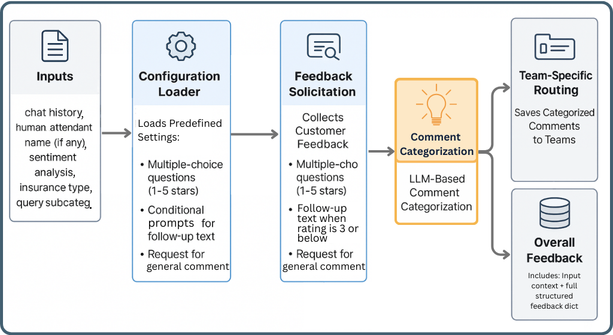
</p>
(Coleta feedback estruturado (escalas) e textual do usuário ao final da interação e classifica automaticamente os comentários)

### Módulo 7: Construtor de Base de Conhecimento

<p align="center">
  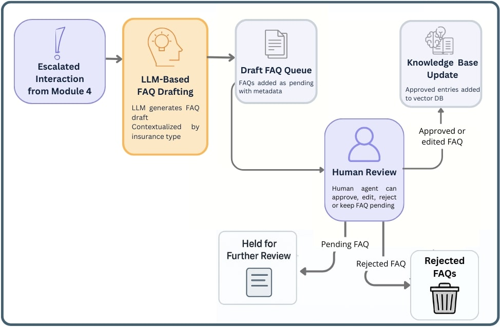
</p>
(Identifica consultas não resolvidas automaticamente e gera rascunhos de novas entradas de FAQ para revisão humana, facilitando a melhoria contínua da base de conhecimento)

### Módulo 8: Verificador de Resolução

<p align="center">
  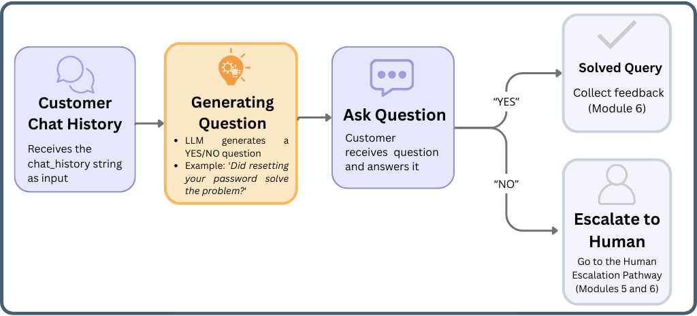
</p>
(Verifica explicitamente com o usuário, através de uma pergunta contextualizada, se a resposta ou solução automática fornecida resolveu sua necessidade)

### Módulo 9: Verificador de Conformidade

<p align="center">
  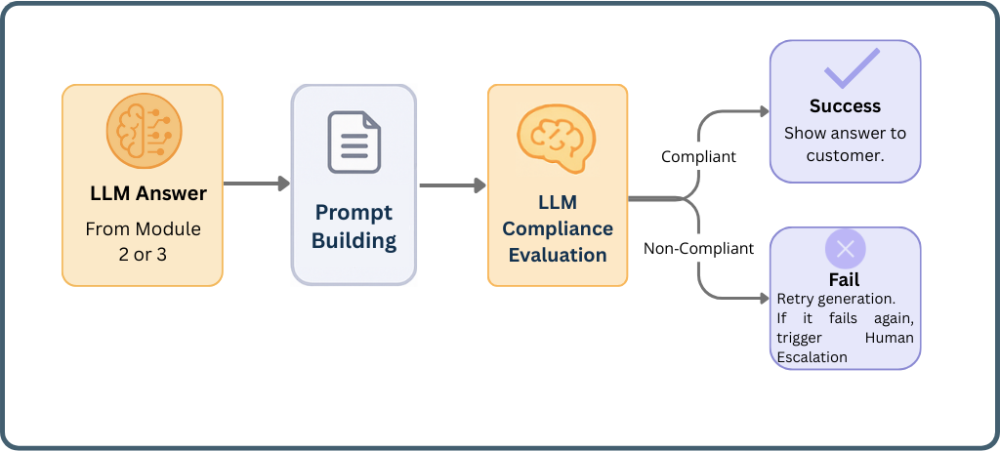
</p>
(Atua como um gatekeeper de segurança e qualidade, avaliando se as respostas geradas por LLMs atendem a critérios predefinidos (confidencialidade, tom, completude, etc.) antes de serem exibidas ao usuário)

---


## 🛠️ Pré-requisitos

Para executar e avaliar este protótipo, você precisará de:

1.  **Conta Google:** Para usar o Google Colab e o Google Drive.
2.  **Conta Groq:** Para gerar uma chave de API (necessária para acesso aos LLMs utilizados). Crie em [https://groq.com/](https://groq.com/).
3.  **Conta Hugging Face:** Para gerar um token de acesso (necessário para o Módulo 5 - Análise de Sentimento). Crie em [https://huggingface.co/](https://huggingface.co/).

##  🧭 Instruções para Execução e Avaliação (Ambiente Recomendado: Google Colab)

Siga os passos abaixo para configurar e executar o protótipo:

1. 💾 **Download e Upload para Google Drive:**
    *   Faça o download completo deste repositório (`STELLAR_MVP_Selo_de_Inovacao`) como um arquivo ZIP ou clone-o.
    *   Descompacte (se necessário) e faça o **upload da pasta inteira** para o seu Google Drive.
    *   **Anote o caminho** completo onde a pasta foi salva no seu Google Drive (ex: `MyDrive/Colab Notebooks/STELLAR_MVP_Selo_de_Inovacao`).

2. 💻 **Abrir o Notebook no Google Colab:**
    *   Navegue até a pasta `STELLAR_MVP_Selo_de_Inovacao` dentro do seu Google Drive.
    *   Localize o arquivo `STELLAR.ipynb`.
    *   Clique com o botão direito sobre o arquivo e selecione "Abrir com" > "Google Colaboratory".

3. 🗺️ **Configurar o Caminho do Projeto:**
    *   No notebook `STELLAR.ipynb` que abriu no Colab, localize a **primeira célula de código**.
    *   Edite a variável `STELLAR_path` e **substitua o valor existente pelo caminho completo** da pasta no seu Google Drive (anotado no passo 1).
    *   OBS: O caminho deve indicar o local da pasta interna `STELLAR_Selo_de_Inovacao`, e não da pasta externa, que contém este README.
        *   *Exemplo:* `STELLAR_path = "/content/drive/MyDrive/Colab Notebooks/STELLAR_MVP_Selo_de_Inovacao"`

4. 🔑 **Configurar Chaves de API e Token (Via Colab Secrets):**
    *   **Gere suas chaves/tokens:** Acesse suas contas Groq e Hugging Face e gere uma API Key (Groq) e um Access Token (Hugging Face - geralmente com permissão de leitura).
    *   **Adicione os Secrets no Colab:**
        *   No ambiente do Colab, clique no ícone de chave (🔑) no painel lateral esquerdo ("Secrets").
        *   Crie um novo secret chamado `GROQ_API_KEY` e cole sua chave de API da Groq como valor.
        *   Crie outro secret chamado `HF_TOKEN` e cole seu token do Hugging Face como valor.
        *   **Importante:** Certifique-se de que a opção "Notebook access" esteja **habilitada** para ambos os secrets.

5. ▶️ **Executar o Protótipo:**
    *   Execute as células do notebook `STELLAR.ipynb` **sequencialmente**, começando pela seção `1. Requirements`.
    *   A **Seção 2 (`Modules`)** contém a implementação de cada módulo individualmente, com exemplos de uso caso deseje testá-los separadamente.
    *   Prossiga a execução até a **Seção 3 (`System`)**, especificamente até a subseção **`3.3.2 Workflow Examples`**. Esta seção demonstra como executar a arquitetura completa.
    *   *Exemplo de execução do fluxo completo:*
        ```python
        # Escolha uma query (exemplos fornecidos ou crie a sua)
        query = "Eu sou o José e gostaria de saber como funciona o seguro dental Bradesco." # Exemplo Categoria 0 - FAQs
        # query = "Onde posso ligar para renovar meu seguro de Saúde?" # Exemplo Categoria 1 - Informação de Contato
        # query = "Eu sou o Gabriel, do plano de seguro de vida. Preciso da ajuda de um atendente urgentemente." # Exemplo Categoria 2 - Atendente Humano
        # query = "Qual é o maior animal do mundo?" # Exemplo Categoria 3 - Não pertinente

        # Instancia e processa
        workflow = WorkflowManager()
        final_state_and_logs = workflow.process_query(query)

        # O log completo será impresso na célula seguinte (3.3.3)
        ```

6.  📊 **Testar e Avaliar:**
    *   Execute as células na seção `3.3.2 Workflow Examples` para observar o protótipo processando diferentes tipos de consulta.
    *   Sinta-se à vontade para modificar a variável `query` com suas próprias perguntas (em português) relacionadas aos serviços da Bradesco Seguros.
    *   Execute a célula na seção **`3.3.3 Log example`** após processar uma query. O output detalhado (`final_state_and_logs`) mostrará informações cruciais para avaliação, incluindo:
        *   `chat_history`: O histórico da conversa.
        *   `sequence_of_modules`: A sequência exata de módulos executados (o fluxo DAG percorrido).
        *   `execution_logs`: O tempo de execução e a resposta fornecida por cada módulo.
        *   Outros dados relevantes sobre o estado final da interação.
    *   Analise esses logs para verificar o funcionamento dos diferentes fluxos de trabalho e a lógica de controle da arquitetura STELLAR.

## 📁 Estrutura do Repositório
```bash
│ STELLAR.ipynb # Notebook principal com a implementação e testes
│
├───human_agents # Dados de exemplo para agentes humanos (Módulo 4)
│ └───human_agents.json
│
├───images # Imagens usadas na documentação/apresentação
│ ... (diagramas de fluxo, etc.)
│
├───logs # Logs gerados durante a execução (ex: logs gerais)
│ └───workflow_logs.json
│
├───outputs # Arquivos gerados pelos módulos
│ ├───module_4 # Saídas do Módulo 4 (ex: lista de espera)
│ ├───module_6 # Saídas do Módulo 6 (ex: feedback coletado)
│ ├───module_7 # Saídas do Módulo 7 (ex: FAQs para revisão)
│ └───module_9 # Saídas do Módulo 9 (ex: logs de violação)
│
└───requirements # Arquivos de configuração, prompts e dados estáticos
├───module_1 # Configs/Prompts do Módulo 1
├───module_2 # Configs/Prompts/DB do Módulo 2 (RAG)
├───module_3 # Configs/Prompts do Módulo 3
├───module_4 # Configs/Prompts do Módulo 4
├───module_6 # Configs/Prompts do Módulo 6
├───module_7 # Configs/Prompts do Módulo 7
├───module_8 # Configs/Prompts do Módulo 8
└───module_9 # Configs/Prompts do Módulo 9
```
## 📌 Observação Importante para Avaliação

O protótipo utiliza uma base de conhecimento de FAQs (para o Módulo 2) extraída de informações públicas da Bradesco Seguros, que é inerentemente limitada. Portanto, **muitas perguntas podem não ter uma resposta direta na base de FAQs**. Nesses casos, o comportamento **esperado e correto** do STELLAR é acionar seus mecanismos de fallback (definidos pela arquitetura DAG) e encaminhar a interação para o fluxo de escalonamento humano (Módulo 4), após as devidas verificações dos Módulos 9 e/ou 8. Observar esse comportamento demonstra o funcionamento adequado da lógica de controle e das salvaguardas do sistema para lidar com consultas fora do escopo automatizável.

---

📧 Em caso de dificuldades técnicas significativas durante a avaliação deste protótipo, por favor, entre em contato: m252099@dac.unicamp.br
